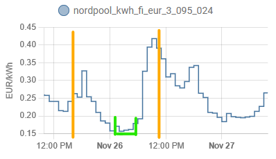
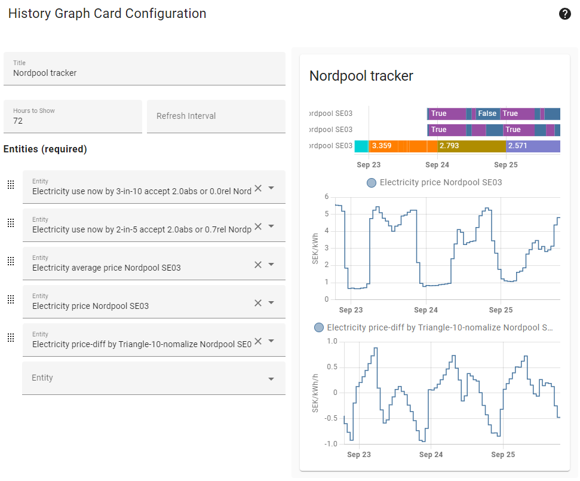

# nordpool_planner custom component for Home Assistant

Requires https://github.com/custom-components/nordpool

> **NOTE**: This is a based on https://github.com/jpulakka/nordpool_diff

[Nord Pool](https://www.nordpoolgroup.com/) gives you spot prices, but making good use of those prices is not easy.
This component provides various a boolean if now is the right time to activate high consumption based on future prices in a specified range. Given a time-span from now and an number of hours forward it searches for the start-time that has the lowest average price over a specified duration window.

Apart from potentially saving some money, this kind of temporal shifting of consumption can also save the environment, because expensive peaks are produced by dirtier energy sources. Also helps solving Europe's electricity crisis.

## Installation

### Option 1: HACS
1. Install and configure https://github.com/custom-components/nordpool first.
2. Go to HACS -> Integrations
3. Click the three dots on the top right and select `Custom Repositories`
4. Enter `https://github.com/dala318/nordpool_planner` as repository, select the category `Integration` and click Add
5. A new custom integration shows up for installation (Nordpool Planner) - install it
6. Restart Home Assistant

### Option 2: Manual

1. Install and configure https://github.com/custom-components/nordpool first.
2. Copy the `nordpool_planner` folder to HA `<config_dir>/custom_components/nordpool_planner/`
3. Restart HA. (Skipping restarting before modifying configuration would give "Integration 'nordpool_diff' not found"
   error message from the configuration.)

### Configuration

1. Add the following to your `configuration.yaml` file:

    ```yaml
    binary_sensor:
      - platform: nordpool_planner
        nordpool_entity: sensor.nordpool_kwh_fi_eur_3_095_024
        entity_id: activate_heating

        moving:
          search_length: 8
        <or>
        static:
          end_hour: 7
    ```

   Exclusively either of `moving` or `static` shall be specified, determines the behavior of the sensor. See further down about usage.

   Modify the `nordpool_entity` value according to your exact nordpool entity ID, give the entity a describing name and select one of two planner types `moving` or `static`.

   `moving` planner searches in a constant window in the future

   `static` planner searches for an ammount of cheap hours until a set time (work in progress!)

2. Restart HA again to load the configuration. Now you should see `nordpool_planner_2_10_0_0_0_0` binary_sensor, where
   the `2_10_0_0_0_0` part corresponds to default values of optional parameters, explained below.

## Optional parameters

There are some optional parameters that could be provided to the sensor, they can be grouped in some categories.

Generic optional: `duration` (2), `var_duration_entity` (""), `accept_cost` (0.0) and `accept_rate` (0.0). Default values in parenthesis.

`duration` can be in the range of 1 to 5 and specifies how large window of censecutive hours to slide forward in search for a minimum average price.

`var_duration_entity` an entity that provides a numerical value in hours.

The integration will use `var_duration_entity` if supplied and can be interpreted as int, otherwise `duration` or the default value.

A simple way to get you a slider to manually select an input entity value is by an `input_number` as below

```yaml
input_number:
  np_time:
    name: Time to Nordpool Planner
    initial: 2
    min: 0
    max: 24
    step: 1
 ```

`accept_cost` specifies a price level in the currency of your `nordpool_entity`, that if an "average over a duration" is below this value, it is accepted and used. Even if not the lowest in the range specified.

`accept_rate` specifies a price rate, that if an "average over a duration" divided by nordpool average (`nordpool_entity.attributes.average`) is below this rate, it is accepted and used. Even if not the lowest in the range specified. E.g. if set to 1 an "average over a duration" <= "nordpool average" is accepted. If 0.5 it has to be half the price of "nordpool average". The idea is to not be as sensitive to offsets I price levels but just a generic rule to accept low section, not just the lowest.

The planner types has some additional configuration variables

### Moving

Optional parameter `var_search_length_entity` (""). Default value in parenthesis.

 ```yaml
 binary_sensor:
   - platform: nordpool_planner
     nordpool_entity: sensor.nordpool_kwh_fi_eur_3_095_024
     entity_id: "heat_house_when_cheap"
     duration: 2
     var_duration_entity: input_number.needed_ammount_of_hours
     accept_cost: 0.0
     accept_rate: 0.0
     moving:
      search_length: 10
      var_search_length_entity: input_number.look_this_far_ahead
 ```

`search_length` can be in the range of 2 to 24 and specifies how many hours ahead to serach for lowest price.

`var_search_length_entity` an entity that provides a numerical value in hours.

The integration will use minimum of `var_search_length_entity` (if supplied and can be interpreted as int) and `duration` (or the default value).

### Static

> **WORK IN PROGRESS**: This version of entity is still not fully tested, may need some more work to work properly.


Optional parameters `var_end_hour_entity` ("") and `split_hours` (false). Default values in parenthesis.

 ```yaml
 binary_sensor:
   - platform: nordpool_planner
     nordpool_entity: sensor.nordpool_kwh_fi_eur_3_095_024
     entity_id: "heat house when cheap"
     duration: 2
     var_duration_entity: input_number.needed_ammount_of_hours
     accept_cost: 0.0
     accept_rate: 0.0
     static:
      end_hour: 7
      var_end_hour_entity: input_number.need_fully_charged_car_at
      split_hours: false
 ```

`end_hour` can be in the range of 0 to 23 and specifies at what time within 24 hours the ammount of active hours shall be selected.

`var_end_hour_entity` an entity that provides a numerical value in hours.

The integration will use `var_end_hour_entity` if supplied and can be interpreted as int, otherwise `end_hour` or the default value.

> **NOT IMPLEMENTED**: No support implemented to use this setting
`split_hours` tell if allowed to find low-cost hours that are not censecutive


## Attributes

Apart from the true/false if now is the time to turn on electricity usage the sensor provides some attributes.

`starts_at` tell when the next low-point starts

`cost_at` tell what the average cost is at the lowest point identified

`now_cost_rate` tell a comparison current price / best average. Is just a comparison to how much more expensive the electricity is right now compared to the found slot. E.g. 2 means you could half the cost by waiting for the found slot.

## Usage

Some words should be said about the usage and how it behaves.

The search length variable should be set to to a value within which you could accept no high electricity usage, and the ratio window/search should somewhat correspond to the active/passive time of your main user of electricity. Still, the search window for the optimal spot to electricity is moving along in front of corrent time, so there might be a longer duration of passive usage than the search length. Therefor keeping the search length low (3-5h) should likely be optimal, unless you have a large storage capacity of electricity/heat that can wait for a longer duration and when cheap electricity draw as much as possible.

If to explain by an image, first orange is now, second orange is `search_length` ahead in time, width of green is `duration` and placed where it has found the cheapest average price within the orange.



Try it and feedback how it works or if there are any improvment to be done!

### Tuning your settings

I found it usefull to setup a simple history graph chart comparing the values from `nordpool`, `nordpool_diff` and `nordpool_planner` like this.



Where from top to bottom my named entities are:

* nordpool_diff: duration 3 in search_length 10, accept_cost 2.0
* nordpool_diff: duration 2 in search_lenth 5, accept_cost 2.0 and accept_rate 0.7
* nordpool average: just a template sensor extracting the nordpool attribute average to an entity for easier tracking and comparisons "{{ state_attr('sensor.nordpool_kwh_se3_sek_3_10_025', 'average') | float }}"
* nordpool
* nordpool_diff:
